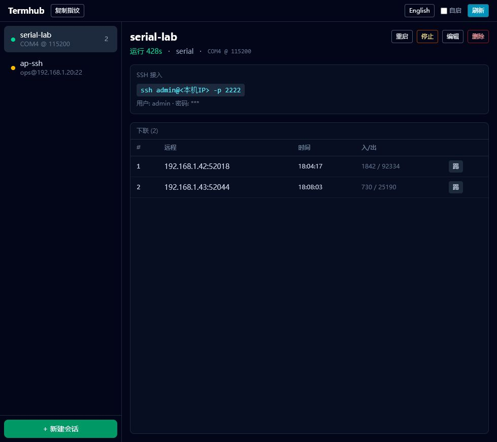
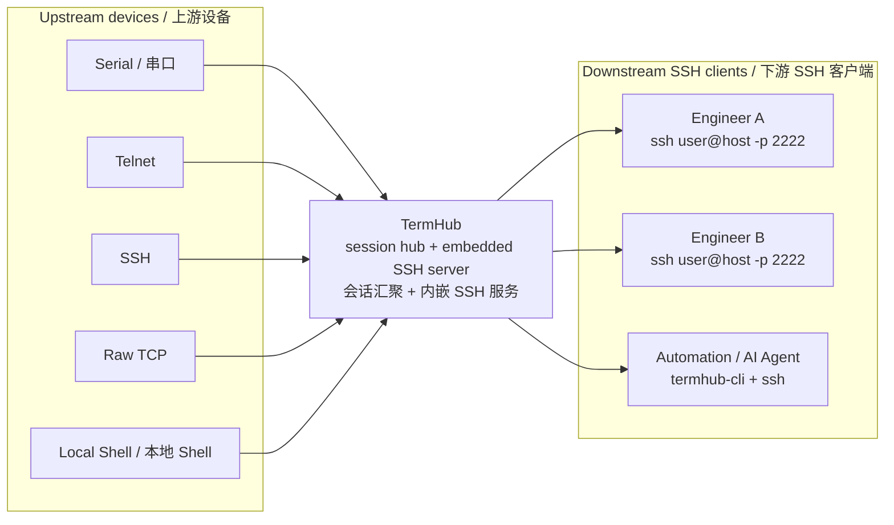

# TermHub

[](https://github.com/18307211566/termhub/actions/workflows/ci.yml)
[](#license--许可证)

[English](#english) | [中文](#中文)



## What TermHub Does / TermHub 的作用



## English

TermHub is a LAN terminal sharing tool for Windows. It connects to upstream devices through SSH, serial ports, Telnet, raw TCP, local shell, or port forwarding, then exposes each session through an embedded SSH server so multiple people can watch the same output and type into the same session.

It is inspired by [Upterm](https://github.com/owenthereal/upterm), but focuses on LAN collaboration, native GUI configuration, embedded debugging workflows, and bilingual Chinese / English UI.

### Features

- Shared terminal fan-out and input fan-in for each session.
- Upstream drivers for Serial, SSH, Telnet, Raw TCP, Local Shell, Loopback, and HTTP/TCP/UDP port forwarding.
- Per-session downstream SSH access with username, password, listen address, and PTY override.
- Auto reconnect for unstable upstream links.
- System tray residency for long-running sessions.
- TOML persistence with Windows DPAPI protection for saved passwords.
- Real-time client list, traffic counters, and kick controls.
- Chinese / English UI language toggle.

### Quick Start

1. Download the latest MSI from GitHub Releases.
2. Start TermHub and create a session in the GUI.
3. Connect from another machine on the LAN:

```bash
ssh <session-user>@<termhub-host-ip> -p 2222
# Enter the password configured for that session.
```

### Security Note

TermHub is intended for trusted LAN use. If a session listens on `0.0.0.0:2222`, anyone who can reach the host and knows the session credentials can connect.

- Use strong per-session passwords.
- Prefer `127.0.0.1` when you only need local access.
- Firewall exposed ports before using TermHub outside a trusted LAN.
- See [SECURITY.md](SECURITY.md) for reporting and operational guidance.

### Development

Requirements:

| Dependency | Minimum | Notes |
|---|---:|---|
| Rust | 1.79+ | Installed through [rustup](https://rustup.rs/); `rust-toolchain.toml` selects stable |
| Node.js | 18+ | Used by the React UI |
| npm | 9+ | Ships with Node.js |
| Tauri CLI | 2.x | Install with `cargo install tauri-cli --version "^2"` |

```bash
cd crates/termhub-app/ui
npm ci
cd ../../..

cargo test --workspace
cargo clippy --workspace --all-targets -- -D warnings
```

Run the desktop app:

```bash
cd crates/termhub-app
cargo tauri dev
```

Build installers:

```bash
cd crates/termhub-app/ui
npm ci
cd ..
cargo tauri build
```

### CLI

`termhub-cli` controls a running TermHub desktop instance through the local HTTP API.

```bash
termhub-cli session list
termhub-cli session create lab pass123 --upstream serial --port COM3 --baud 115200
termhub-cli session create ap pass123 --upstream ssh --host 192.168.1.10 --user admin --password secret
termhub-cli client list lab
termhub-cli server info
termhub-cli serial-ports
```

All commands support `--json`.

## 中文

TermHub 是一个面向局域网协作的终端汇聚工具，主要运行在 Windows 上。它可以通过 SSH、串口、Telnet、Raw TCP、本地 Shell 或端口转发连接上游设备，再通过内嵌 SSH server 把每个会话共享给多人同时接入：大家看到同一份输出，也都可以输入。

项目参考了 [Upterm](https://github.com/owenthereal/upterm)，但 TermHub 更偏向局域网协作、原生 GUI 配置、嵌入式调试场景，并且软件界面支持中文 / 英文切换。

### 核心特性

- 每个会话的输出完全共享，多个下联输入合流写入上游。
- 支持 Serial、SSH、Telnet、Raw TCP、Local Shell、Loopback、HTTP/TCP/UDP 端口转发。
- 每个会话可独立配置下联 SSH 用户名、密码、监听地址和 PTY 尺寸。
- 上游断线后自动重连。
- 托盘常驻，适合长时间共享调试会话。
- TOML 配置持久化，密码字段在 Windows 上使用 DPAPI 保护。
- 实时下联列表、流量统计和踢人控制。
- 软件 UI 支持中文 / 英文切换。

### 快速上手

1. 从 GitHub Releases 下载最新 MSI 安装包。
2. 启动 TermHub，在 GUI 中创建会话。
3. 局域网内其他设备执行：

```bash
ssh <会话用户>@<termhub主机IP> -p 2222
# 密码为创建会话时设定的密码
```

### 安全提示

TermHub 默认面向可信局域网。如果会话监听 `0.0.0.0:2222`，局域网内任何能访问该主机且知道会话凭据的人都可以连接。

- 为每个会话使用强密码。
- 仅本机使用时优先监听 `127.0.0.1`。
- 如果要跨网段或公网使用，请先配置防火墙和访问控制。
- 漏洞报告和安全建议见 [SECURITY.md](SECURITY.md)。

### 开发

依赖：

| 依赖 | 最低版本 | 说明 |
|---|---:|---|
| Rust | 1.79+ | 通过 [rustup](https://rustup.rs/) 安装，`rust-toolchain.toml` 使用 stable |
| Node.js | 18+ | 用于 React 前端 |
| npm | 9+ | 随 Node.js 安装 |
| Tauri CLI | 2.x | `cargo install tauri-cli --version "^2"` |

```bash
cd crates/termhub-app/ui
npm ci
cd ../../..

cargo test --workspace
cargo clippy --workspace --all-targets -- -D warnings
```

启动桌面应用：

```bash
cd crates/termhub-app
cargo tauri dev
```

构建安装包：

```bash
cd crates/termhub-app/ui
npm ci
cd ..
cargo tauri build
```

### CLI 命令行工具

`termhub-cli` 通过本地 HTTP API 操作正在运行的 TermHub 桌面应用。

```bash
termhub-cli session list
termhub-cli session create lab pass123 --upstream serial --port COM3 --baud 115200
termhub-cli session create ap pass123 --upstream ssh --host 192.168.1.10 --user admin --password secret
termhub-cli client list lab
termhub-cli server info
termhub-cli serial-ports
```

所有命令支持 `--json` 输出机器可读 JSON。

## Project Layout / 项目结构

```text
termhub/
├─ crates/
│  ├─ termhub-core/      # Hub, sessions, config, persistence
│  ├─ termhub-drivers/   # Serial, SSH, Telnet, Raw TCP, Local Shell, proxy
│  ├─ termhub-sshd/      # Embedded downstream SSH server
│  ├─ termhub-app/       # Tauri desktop app and React UI
│  └─ termhub-cli/       # CLI for the local HTTP API
└─ docs/
   ├─ assets/            # README images
   └─ superpowers/       # Design notes
```

## License / 许可证

Licensed under either of:

- [Apache License, Version 2.0](LICENSE-APACHE)
